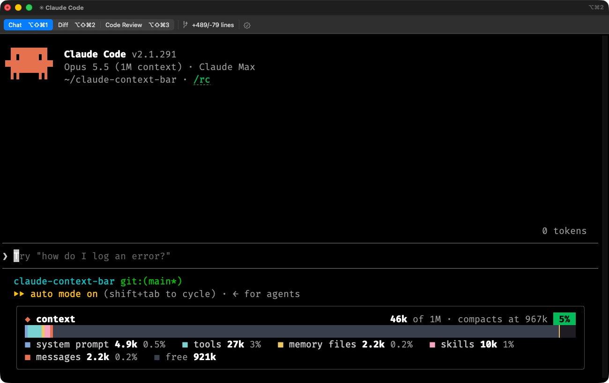
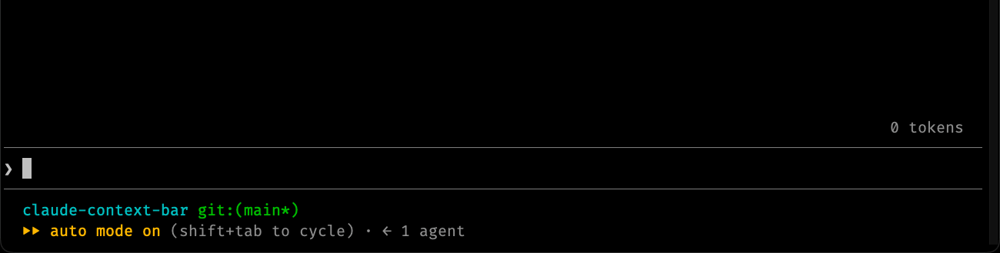
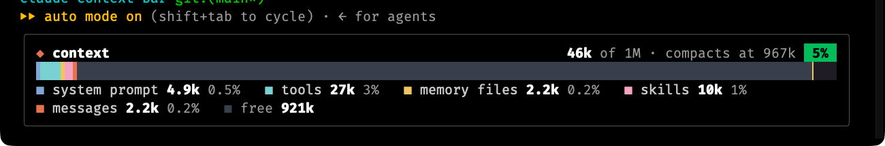

# claude-context-bar

A [Claude Code](https://claude.com/claude-code) mod that draws the context window as a stacked bar under the prompt.



- **Header:** tokens used, the window's size, where autocompaction starts, and the share used. The share's badge is green, then yellow from 60% of the way to compaction, then red from 85%.
- **Bar:** one coloured run per `/context` category, then the free space, a mark where autocompaction starts, and the buffer held back beyond it. Boundaries fall on half cells.
- **Legend:** each category with its token count and share of the window, then the free space.

The bar grows from empty when it appears and slides to its new values when the context changes; each move takes about half a second.



Close-up:



## Install

Run this in a terminal:

```sh
claude plugin marketplace add ContextLab/claude-context-bar && claude plugin install context-bar@claude-context-bar
```

Then start a new Claude Code session. The bar appears under the prompt.

## Use

- The bar updates as the context changes and after each compaction.
- `/context-bar` hides the bar; running it again shows it.

The token counts are Claude Code's local estimates (the same summary `/context` starts from), so the mod sends no extra requests.

Claude Code clips what is drawn under the prompt on a short terminal, so the mod draws less there: the whole box from about 24 rows, the box without its legend from 20, and the header and bar alone below that. A change in the terminal's height takes effect the next time the bar redraws.

The category colours are fixed; the free space and buffer follow a light or dark theme.

## Uninstall

```sh
claude plugin uninstall context-bar@claude-context-bar && claude plugin marketplace remove claude-context-bar
```

## Develop

The mod is a hooks module with no build step and no dependencies.

| Path | What it holds |
|-|-|
| `hooks/register.tsx` | The hooks: the `/context-bar` command, the refresh on context changes, the animation, and the drawing |
| `hooks/cells.ts` | Splitting the bar's width among categories, half-cell painting, formatting, easing, and fitting the drawing to the terminal's height |
| `hooks/register.test.ts` | Tests |
| `types/index.d.ts` | The mod's state contract |
| `.claude-plugin/` | The plugin manifest and the marketplace file that makes this repository installable |

Run it from a clone, then test and validate:

```sh
claude --plugin-dir .      # load the mod from this folder for one session
claude plugin test .       # run the tests
claude plugin validate .   # check the manifests and the hooks module
```

Loading the mod writes Claude Code's type definitions to `.claude-plugin/types/` (git-ignored); after that, `npx -p typescript tsc -p .` type-checks it.

## Credit

The idea for this mod comes from the "Claude Code Mods" documentation, [Getting started with Claude Code mods](https://claude.dev/blog/getting-started-with-claude-code-mods/). The context bar example is no longer on that page; it appeared in the newsletter version of the post.
